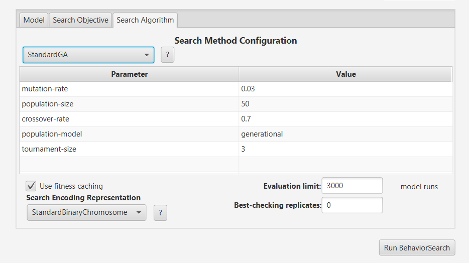
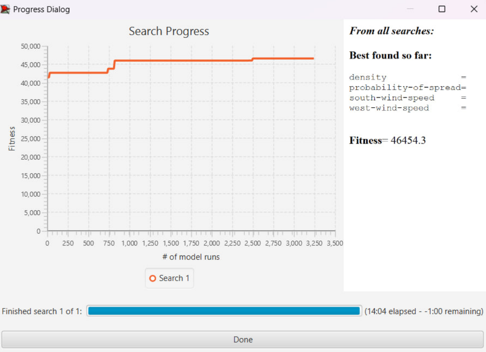
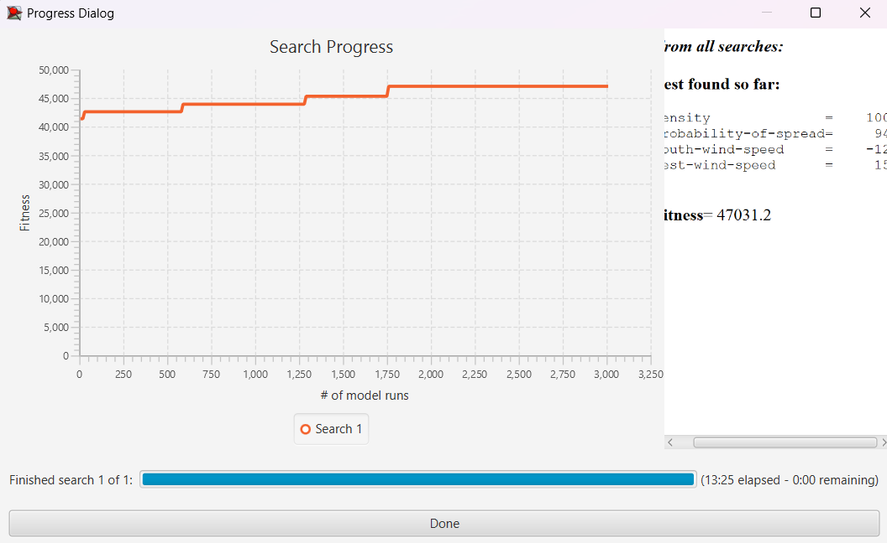
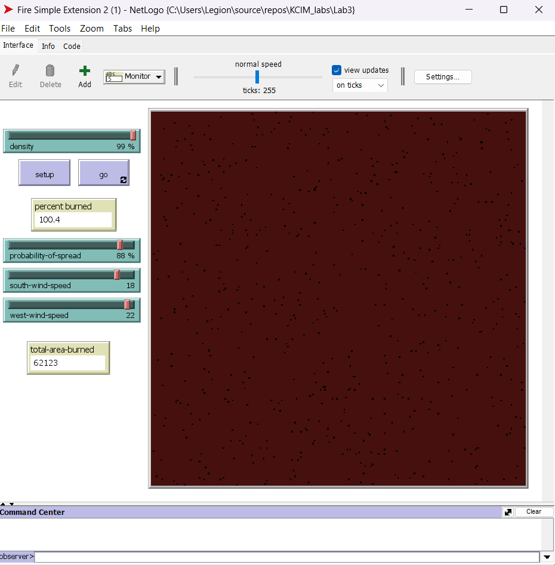

## Комп'ютерні системи імітаційного моделювання
## СПм-23-5, **Дрозд Олег Юрійович**
### Лабораторна робота №**3**. Використання засобів обчислювального інтелекту для оптимізації імітаційних моделей

 

### Варіант 5, модель у середовищі NetLogo:
[Fire Simple Extension 2.](http://www.netlogoweb.org/launch#http://www.netlogoweb.org/assets/modelslib/IABM%20Textbook/chapter%203/Fire%20Extensions/Fire%20Simple%20Extension%202.nlogo)

 

#### Вербальний опис моделі:

Симуляція поширення вогню через ліс. Вогонь починається з лівого (західного) краю і за допомогою визначених правил та впливаючих параметрів поширюється у протилежний бік. Кожен осередок вогню має ймовірність поширитися на сусідні клітини лісу. Щільність лісу встановлюється на початку симуляції, а на ймовірність поширення впливають однойменний параметр і напрямки вітру.

### Керуючі параметри:
- **density** визначає щільність покриття площини лісом.
- **probability of spread** визначае початково задану вірогідність розповсюдження вогню на сусідню клітинку.
- **south-wind-speed** визначає швидкість південного вітру.
- **west-wind-speed** визначає швидкість західного вітру.

### Показники роботи системи:
- **percent burned** - Відносна кількість сгорівших дерев.

### Внутрішні параметри:
- **initial-trees**. Конкретна кількість дерев на старті програми.

 

### Налаштування середовища BehaviorSearch:

**Обрана модель**:
<pre>
C:\KCIM_labs\Lab3\Fire Simple Extension 2.nlogo
</pre>

**Параметри моделі** (вкладка Model):  
*Параметри та їх модливі діапазони були **автоматично** вилучені середовищем BehaviorSearch із вибраної імітаційної моделі:

<pre>
["density" [0 1 100]]
["probability-of-spread" [0 1 100]]
["south-wind-speed" [-25 1 25]]
["west-wind-speed" [-25 1 25]]
</pre>

Використовувана **міра**:  
Для фітнес-функції  було обрано **кількість згорівшого лісу**

Задля вимірення цього показника було змінено код вихідної моделі

<pre>
globals [
  initial-trees   ;; how many trees (green patches) we started with
  total-area-burned  ;; to keep track of the total area burned
]
</pre>

 

В процедурі setup ініціалізуємо обрану глобальну змінну
<pre>
  set total-area-burned 0  ;; initialize the total area burned
</pre>

В процедурі go інкрементуємо обрану глобальну змінну в випадку кожного згорівшого дерева
<pre>
      if random 100 < probability [
        set pcolor red ;; to catch on fire
        set total-area-burned total-area-burned + 1  ;; increase the total area burned
      ]
</pre>

Кінцева кількість сгорівших дерев повинна враховуватися **в середньому** за весь період симуляції тривалістю, *для приклада*, 500 тактів , починаючи з 0 такту симуляції.  

Параметр зупинки за умовою ("**Stop if**") у разі не використовувався.  
Загальний вигляд вкладки налаштувань параметрів моделі:

**Налаштування цільової функції** (вкладка Search Objective):  
Метою підбору параметрів імітаційної моделі, що описує палаючий ліс, є **максимізація** значення кількості згорівшого лісу – це вказано через параметр "**Goal**" зі значенням **Maximize Fitness**. Тобто необхідно визначити такі параметри налаштувань моделі, у яких кількість згорівшого лісу максимальна. При цьому цікавить не просто кількість сгорівшого лісу в окремий момент симуляції, а середнє її значення за всю симуляцію (тривалість якої (500 кроків) вказувалася на минулій вкладці). Для цього у параметрі "**Collected measure**", що визначає спосіб обліку значень обраного показника, вказано **MEAN_ACROSS_STEPS**.  
Щоб уникнути викривлення результатів через випадкові значення, що використовуються в логіці самої імітаційної моделі, **кожна симуляція повторюється по 10 разів**, результуюче значення розраховується як **середнє арифметичне**. 
Загальний вигляд вкладки налаштувань цільової функції:

**Налаштування алгоритму пошуку** (вкладка Search Algorithm):  

 

### Результати використання BehaviorSearch:

Результат пошуку параметрів імітаційної моделі, використовуючи **генетичний алгоритм**:  

Цифрові результати пошуку за допомогою ГА були обрізані на рисунку, тому знизу додані кінцеві результати пошуку сформовані програмою BehaviorSearch в вихідний файл

Результат пошуку параметрів імітаційної моделі, використовуючи **випадковий пошук**:  

### Перевірка та порівняння результатів дослідження:

Для відображення досліджуваного показнику був доданий монітор який показує кінцеву кількість спалених дерев.

Результати віпробування кінцевих параметрів отриманих з ГА

Результати віпробування кінцевих параметрів отриманих з випадкового алгоритму

Обидва результати представляють собою коректний набір параметрів, що забезпечує максимальне або близьке до максимального значення кількості згорілих дерев. Варто окремо відзначити високу точність результатів випадкового алгоритму, який визначив параметри, що гарантують максимальне згорання дерев. StandartGA, своєю чергою, показав дещо меншу ефективність, але все ж залишився дуже точним.

Висновки: в ході виконання лабораторної роботи опрацювали на практиці використання засобів обчислювального інтелекту для оптимізації імітаційної моделі. Дослід проводили на прикладі максимізації середньої кількості згорілого лісу із використанням алгоритмів випадкого пошуку ьа генетичного алгоритму для моделі поширення вогню через ліс. 
